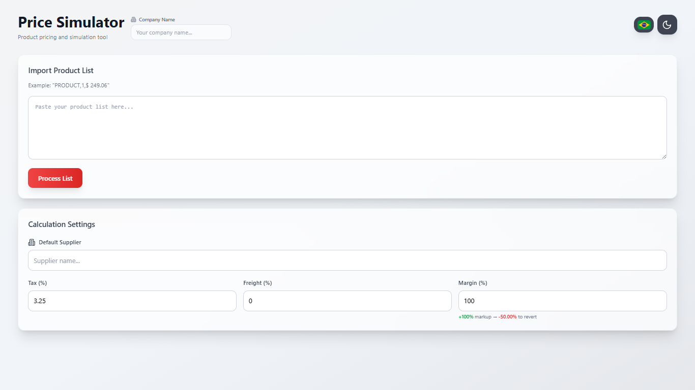
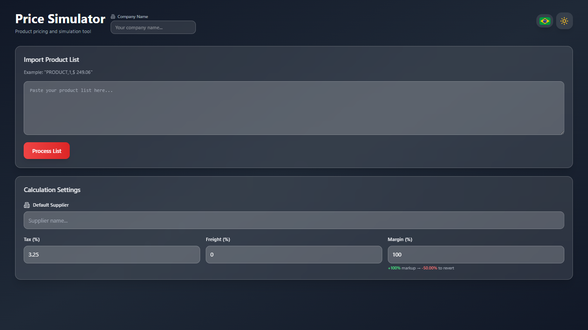
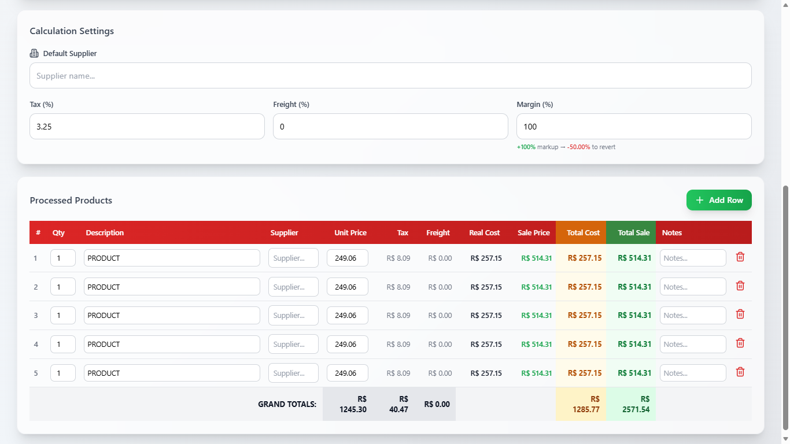
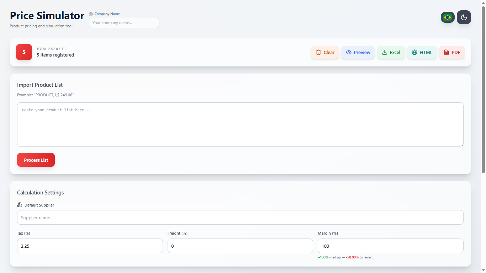
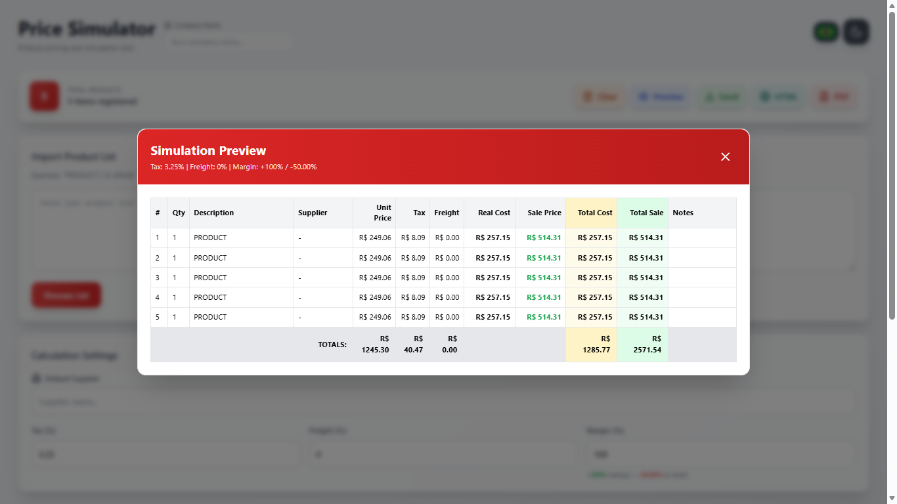
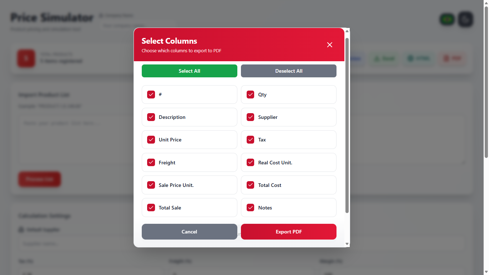
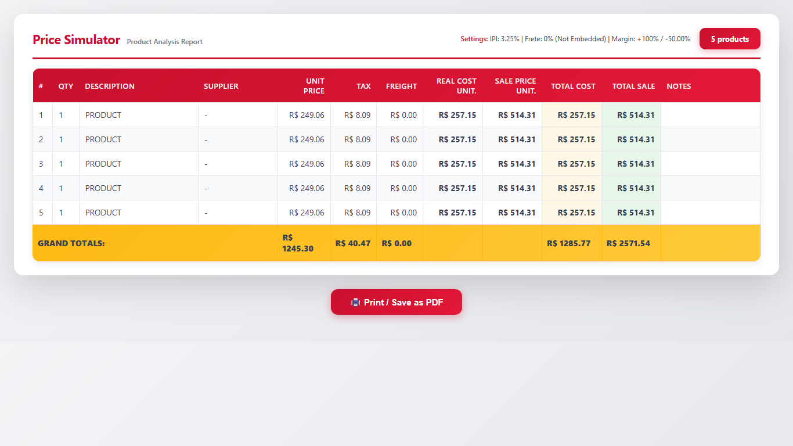

<p align="center">
  
</p>

<h1 align="center">PriceSimulator</h1>

<p align="center">
  <a href="#installation"></a>
  <a href="#installation"></a>
  
  <a href="docs/PriceSim-Documentation-v1.html"></a>
  <a href="#license"></a>
</p>

<p align="center">
  <a href="README.md">🇧🇷 Versão em Português</a>
</p>

A React SPA for **product price simulation**, with automatic IPI, freight and profit margin calculation, free-text list import, and export to XLS, HTML and PDF — with PT-BR and EN support.

---

## What it does

- Imports products via free text (CSV, spreadsheet paste, manual list)
- Automatically calculates: **IPI**, **freight** (normal or built-in), **real cost** and **sale price**
- Displays an editable table with all calculated fields in real time
- Exports to **XLS**, **standalone HTML** and **PDF**
- Allows selecting which columns to include in the export
- **Preview** modal before exporting
- **Light/dark mode** and **PT-BR / EN** support

---

## Screenshots

<p align="center">
  
  
</p>

<p align="center">
  
  
</p>

<p align="center">
  
  
</p>

<p align="center">
  
</p>

Full documentation: [docs/PriceSim-Documentation-v1.html](docs/PriceSim-Documentation-v1.html)

---

## Installation

```bash
# 1. Clone the repository
git clone https://github.com/pedrolabre/price-simulator.git
cd price-simulator

# 2. Install dependencies
npm install

# 3. Start the development server
npm run dev
```

Open `http://localhost:5173`.

---

## Usage

### Import products

Paste any of the formats below into the text field and click **Process**:

```
# CSV (with or without currency symbol)
Product A, 2, R$ 149,90
Product B, 1, $ 249.06

# Simple list
3x USB Cable R$ 29,90
Monitor R$ 1.299,00

# Semicolon-separated
Keyboard; 2; 89,90
```

### Configure parameters

| Parameter | Default | Description |
|---|---|---|
| IPI | 3.25% | Brazilian industrialized product tax |
| Freight | 0% | Freight percentage over cost |
| Margin | 100% | Markup over real cost |

### Export

Click **XLS**, **HTML** or **PDF** in the action bar, select the desired columns and confirm.

---

## Structure

```
src/
├── components/       # UI: Header, ProductTable, ImportSection, modals...
├── hooks/            # useProducts, useCalculations, useParser, useExport
├── utils/            # calculations, parsers, formatters, csvGenerator, xlsGenerator, htmlGenerator, pdfGenerator
├── constants/        # defaults, translations
```

---

## 👨‍💻 Development

### Add a new import format

1. Edit `src/utils/parsers.js` — add a new `if (!matched)` block with the regex
2. Test by pasting the new format into the import field

### Add a new export column

1. Define the field in `src/utils/calculations.js`
2. Register the option in the `ExportModal` column list
3. Map the field in the generators: `xlsGenerator.js`, `htmlGenerator.js`, `pdfGenerator.js`

### Add a new language

1. Add the key in `src/constants/translations.js`
2. Add the toggle in `Header.jsx`

---

## 📝 Code Conventions

- **React 18** with functional hooks
- **Tailwind CSS** for styling — no extra custom CSS
- **Naming**: files in `camelCase`, components in `PascalCase`
- Named exports in all `utils/` and `hooks/`

---

## License

Licensed under the MIT License.

Developer: Pedro Labre
