<div align="right">
  <a href="./README.md">🇧🇷 Português</a> &nbsp;•&nbsp; 🇺🇸 <b>English</b>
</div>

<div align="center">



</div>

<div align="center">


</div>

<div align="center">

[](#-technologies-used)
[](#-technologies-used)
[](#-technologies-used)
[](./docs/PriceSim-Documentation-v1.html)
[](#-license)

</div>

---

React SPA built for **product price simulation**. The application dynamically calculates taxes (IPI), freight rates (standard or built into cost), and profit margins (markup). It also features flexible free-text product list import and multi-format report exports (XLS, standalone HTML, and PDF).

<div align="center">

<table>
  <tr>
    <td align="center" valign="middle" width="80">
      
    </td>
    <td>
      <strong>Price Simulator</strong><br/>
      <small>Price simulator with tax, shipping, margin calculation, and report export.</small><br/>
      <a href="https://price-simulator-psi.vercel.app" target="_blank">
        
      </a>
    </td>
  </tr>
</table>

</div>

---

## 📌 Table of Contents

1. [🎯 What it does](#-what-it-does)
2. [📸 Screenshots](#-screenshots)
3. [⚡ Technologies Used](#-technologies-used)
4. [🚀 Installation and Setup](#-installation-and-setup)
5. [💡 How to Use](#-how-to-use)
6. [📁 Repository Structure](#-repository-structure)
7. [👨‍💻 Development Guide](#-development-guide)
8. [📝 Code Conventions](#-code-conventions)
9. [📄 License](#-license)

---

## 🎯 What it does

- **Smart Import**: Imports products from free text (CSV, spreadsheet pastes, manual lists).
- **Automatic Calculations**: Dynamically computes **IPI**, **freight** (standard or integrated), **real cost**, and **selling price** based on your target profit margin.
- **Dynamic Table**: Renders an interactive table where all values are recalculated in real time as you edit.
- **Flexible Exporting**: Exports your simulation data into **XLS** sheets, standalone **HTML** documents, or **PDF** files.
- **Custom Columns**: Allows selecting which columns to include in or exclude from the generated reports.
- **Print Preview**: Built-in preview modal to check your report layout before exporting.
- **Native Support**: Full support for **light/dark mode** and translations (**PT-BR / EN**).

---

## 📸 Screenshots

Expand the sections below to see the modern and fully responsive design:

<details>
<summary>🖥️ Desktop Layout (Click to expand)</summary>
<br/>

<p align="center">
  <b>Home Screen (Light Mode vs. Dark Mode)</b>
</p>
<p align="center">
  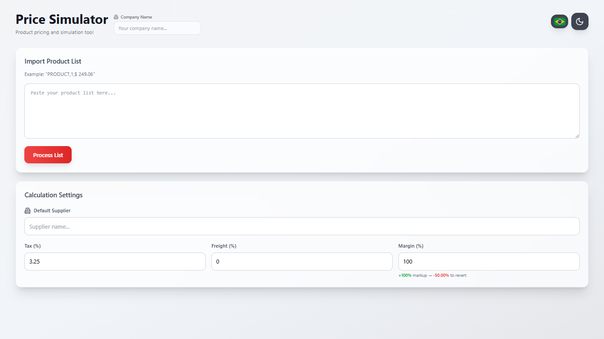
  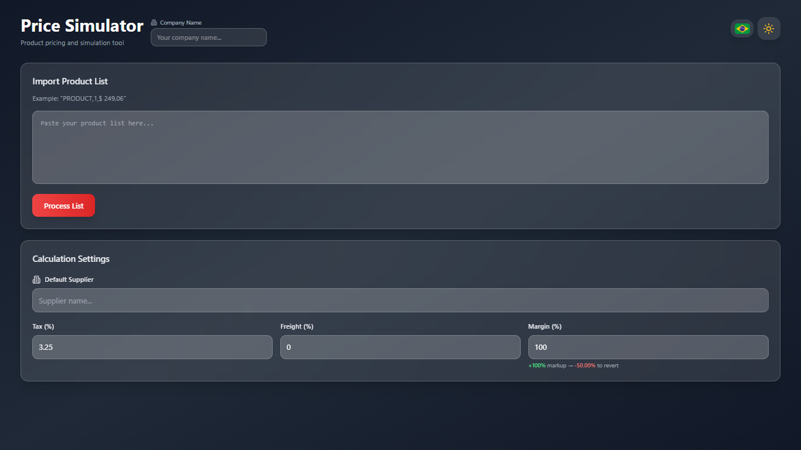
</p>

<p align="center">
  <b>Products Table & Action Bar</b>
</p>
<p align="center">
  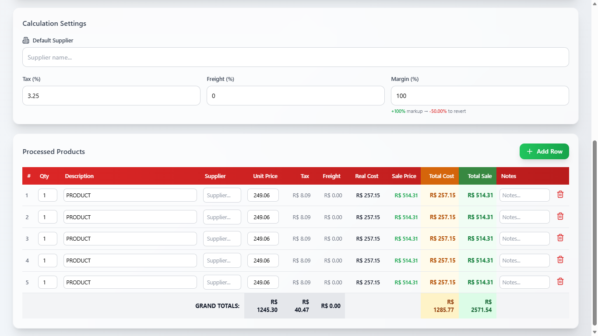
  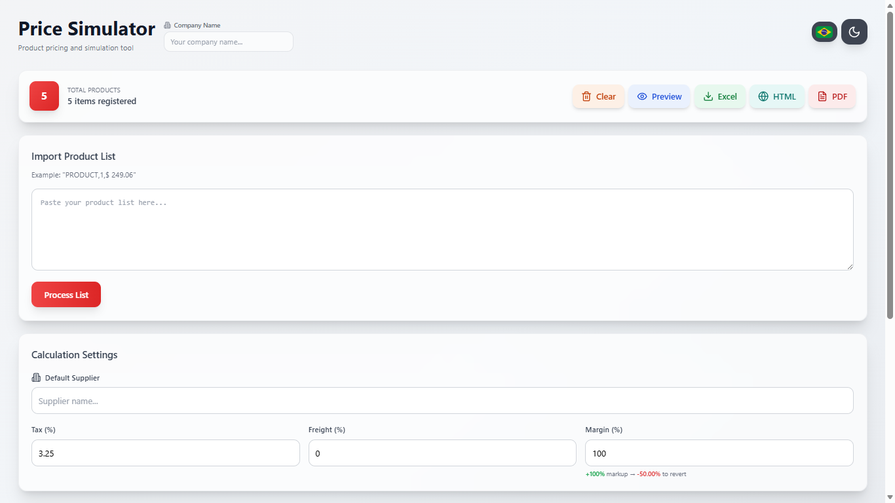
</p>

<p align="center">
  <b>Preview Modal & Column Selection</b>
</p>
<p align="center">
  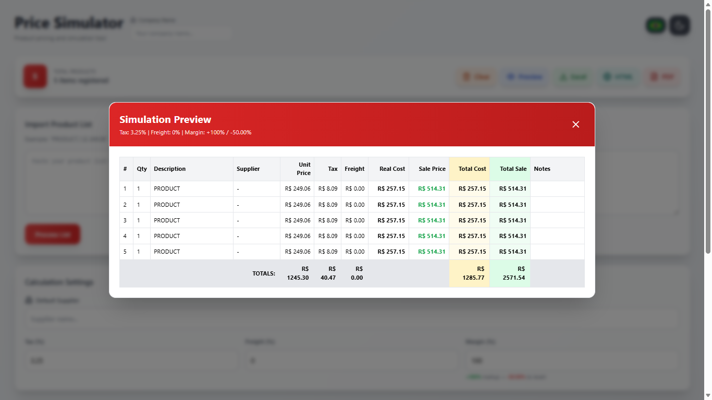
  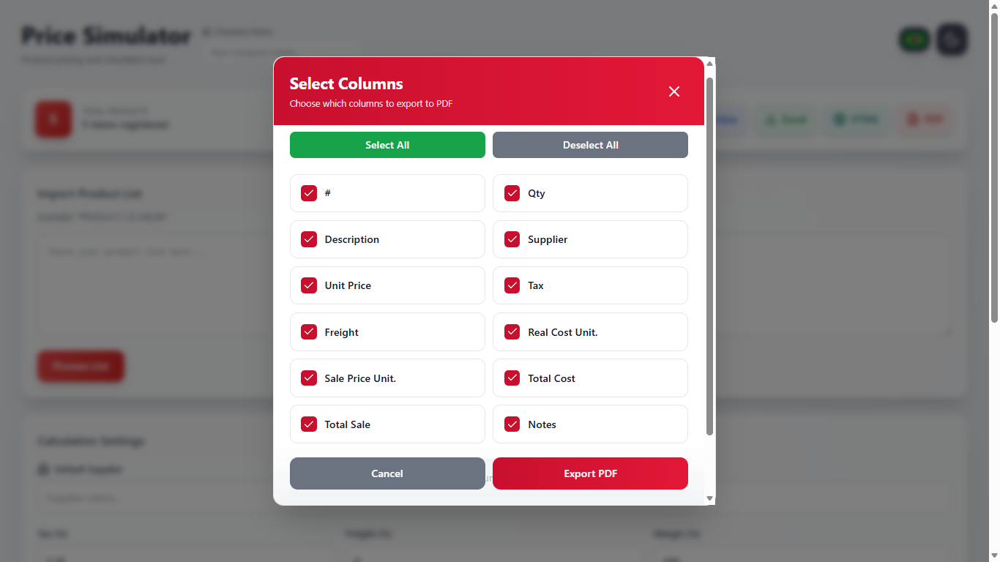
</p>

<p align="center">
  <b>Generated PDF Report</b>
</p>
<p align="center">
  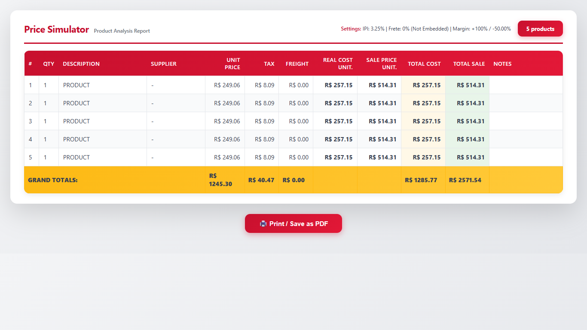
</p>

</details>

<details>
<summary>📱 Mobile Layout (Click to expand)</summary>
<br/>

<div align="center">

| ☀️ Light Mode | 🌙 Dark Mode |
| :---: | :---: |
| **Home Screen** | **Home Screen** |
| 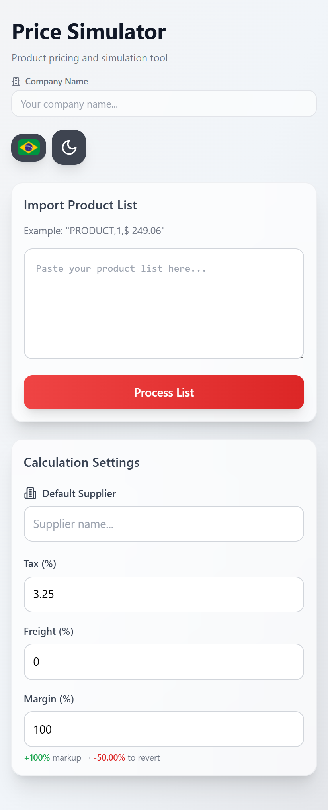 | 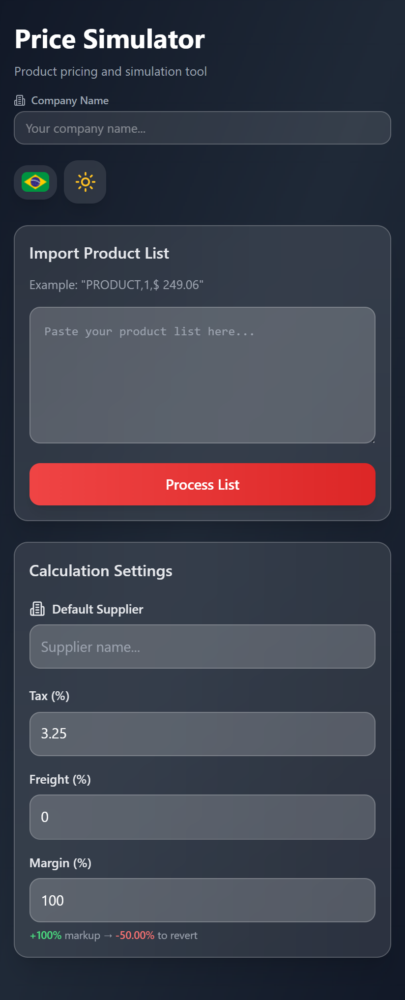 |
| **Products Table** | **Products Table** |
| 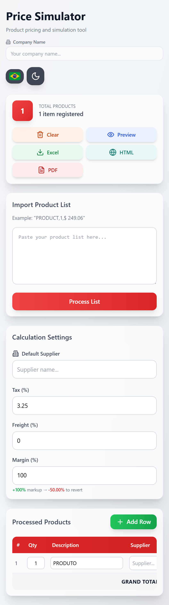 | 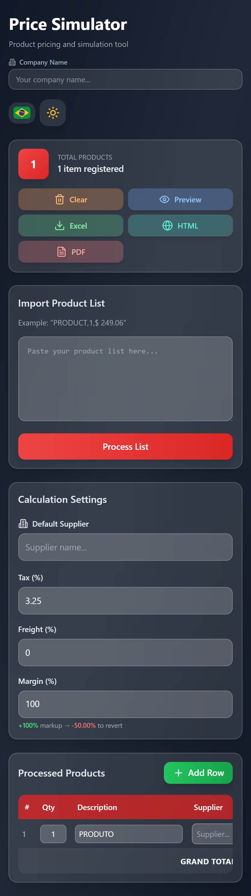 |
| **Column Selection** | **Column Selection** |
| 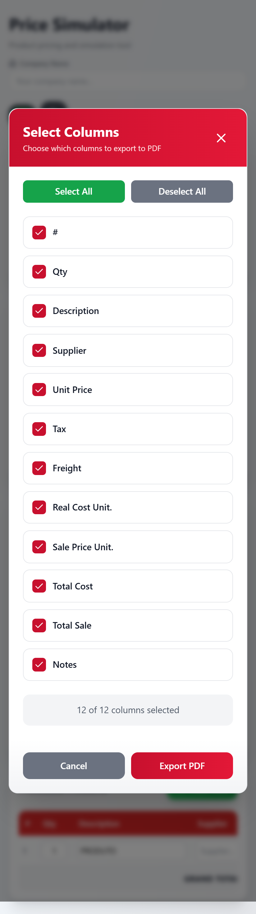 | 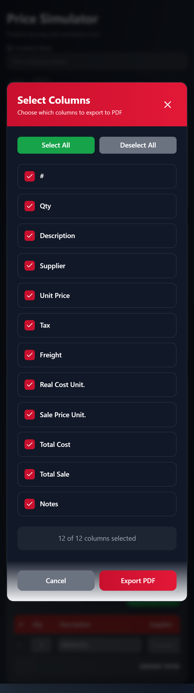 |

</div>

</details>

<br/>

> 📑 **Full documentation:** Access the interactive technical documentation at [docs/PriceSim-Documentation-v1.html](docs/PriceSim-Documentation-v1.html)

---

## ⚡ Technologies Used

The project was built using the following technologies:

- **React 18** — Component-based library for dynamic SPA interfaces
- **Vite** — High-performance build tool for front-end development
- **Tailwind CSS** — Utility-first CSS framework for modern, responsive layouts
- **Lucide React** — SVG icons collection optimized for React applications
- **HTML5 / CSS3** — Core structure and basic web styling
- **Vanilla JS (Generators)** — Custom native logic for XLS, HTML, and PDF conversion (free of large external dependencies)

---

## 🚀 Installation and Setup

Follow the steps below to run the project locally on your machine:

### Step 1: Clone the repository
```bash
git clone https://github.com/pedrolabre/price-simulator.git
cd price-simulator
```

### Step 2: Install dependencies
```bash
npm install
```

### Step 3: Start the development server
```bash
npm run dev
```

Open `http://localhost:5173` in your browser.

---

## 💡 How to Use

### 📥 Import products via free text
Paste your product list into the import area following one of the supported formats, then click **Process**:

#### 1. CSV or Spreadsheet Paste (with or without currency symbols)
```text
Product A, 2, R$ 149,90
Product B, 1, $ 249.06
```

#### 2. Simple Purchase List (quantity + name + price)
```text
3x USB Cable R$ 29,90
Monitor R$ 1.299,00
```

#### 3. Semicolon-Separated List
```text
Keyboard; 2; 89,90
```

### ⚙️ Pricing Parameter Configuration
Adjust the global calculation standards in the header bar:

| Parameter | Default | Description |
| :--- | :---: | :--- |
| **IPI** | `3.25%` | Brazilian Industrialized Product Tax applied to the base cost. |
| **Freight** | `0%` | Shipping percentage added to the base cost. |
| **Margin** | `100%` | Target markup/profit margin calculated over the real cost. |

### 📤 Export Simulation Reports
1. In the top action bar, select your format: **XLS**, **HTML**, or **PDF**.
2. In the column selection pop-up, choose which columns should appear in the report.
3. Check the layout in the preview modal and click export/print.

---

## 📁 Repository Structure

The project directory is structured as follows:

```text
price-simulator/
├── assets/                     # Graphic resources (icons and screenshots)
├── docs/                       # Static documentation files and manuals
├── src/                        # React application source code
│   ├── components/             # UI Components (Header, ProductTable, Modais...)
│   ├── hooks/                  # Custom React hooks (useProducts, useCalculations, useParser...)
│   ├── utils/                  # Generators and helper functions (xlsGenerator, pdfGenerator...)
│   ├── constants/              # Default values and dictionaries (translations...)
│   ├── App.jsx                 # Application root component
│   └── main.jsx                # React entrypoint file
├── package.json                # NPM scripts and dependency definitions
├── tailwind.config.js          # Tailwind CSS settings
└── vite.config.js              # Vite compiler configuration
```

---

## 👨‍💻 Development Guide

To customize or expand this simulator, refer to the guides below:

### 🧩 Add a new import format (Regex)
1. Open the [parsers.js](./src/utils/parsers.js) file.
2. Insert a new validation block `if (!matched)` with custom regex capturing `quantity`, `name`, and `price`.
3. Test it by pasting the new string layout into the import text area.

### 📊 Add a new column to reports
1. Add the calculation math to [calculations.js](./src/utils/calculations.js).
2. Insert the column key into the `ExportModal` component's checkbox list.
3. Map the column data inside the generator scripts:
   - [xlsGenerator.js](./src/utils/xlsGenerator.js)
   - [htmlGenerator.js](./src/utils/htmlGenerator.js)
   - [pdfGenerator.js](./src/utils/pdfGenerator.js)

### 🌐 Add a new language
1. Add translation keys to [translations.js](./src/constants/translations.js).
2. Create the toggle button inside the `Header.jsx` component.

---

## 📝 Code Conventions

To keep the repository clean and maintainable, we follow these guidelines:

- **React 18**: Built exclusively with functional components and hooks.
- **Tailwind CSS**: Direct utility class styling, keeping custom external CSS files to a minimum.
- **Naming Conventions**:
  - Utility and helper files are in `camelCase` (e.g., `xlsGenerator.js`).
  - React components are in `PascalCase` (e.g., `ExportModal.jsx`).
- **Exports**: Named exports are preferred for utilities and custom hooks.

---

## 📄 License

This project is licensed under the **MIT License**. Check the [LICENSE](./LICENSE) file for more information.

---

<div align="center">
Developed with 💙 by <b>Pedro Labre</b>
</div>
