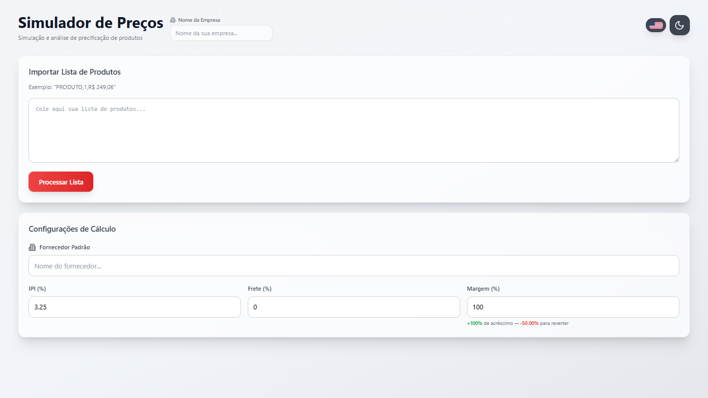
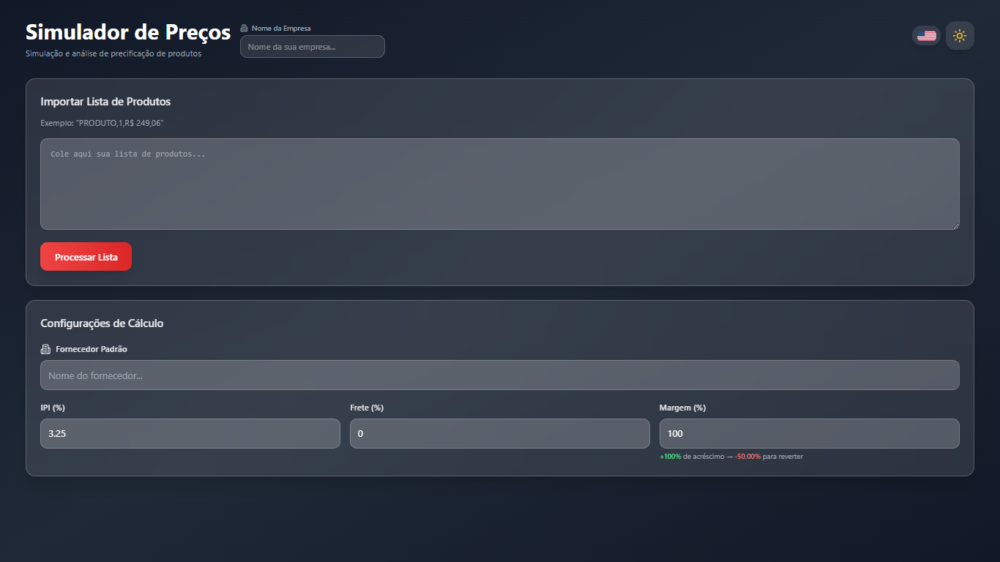
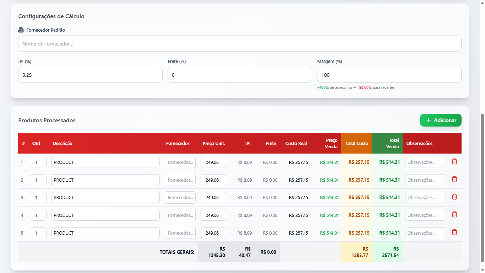
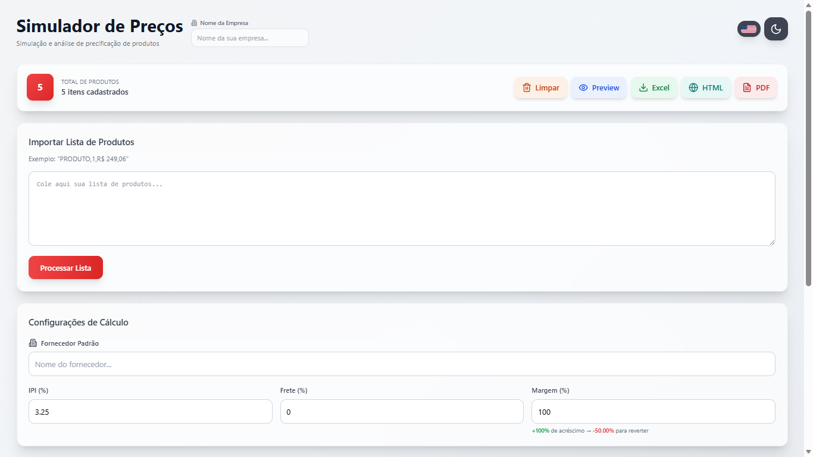
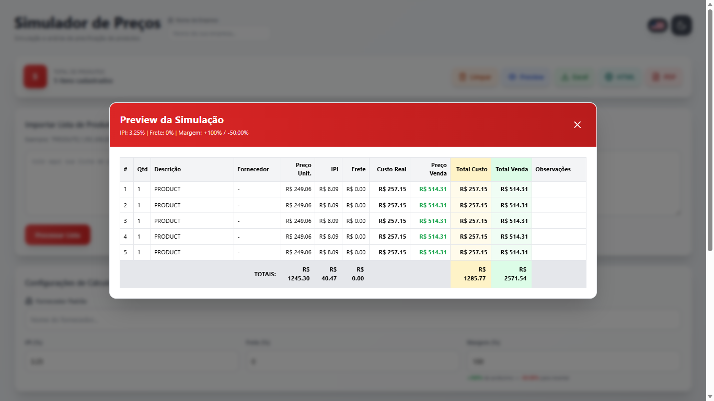
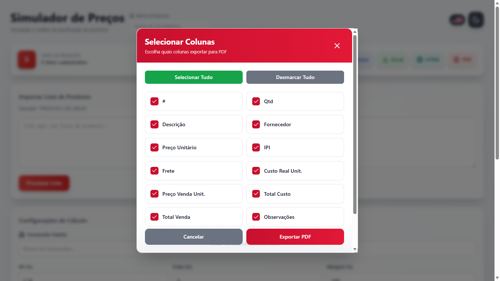
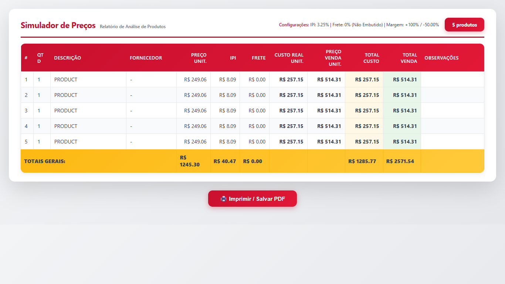

<p align="center">
  
</p>

<h1 align="center">PriceSimulator</h1>

<p align="center">
  <a href="#instalação"></a>
  <a href="#instalação"></a>
  
  <a href="docs/PriceSim-Documentation-v1.html"></a>
  <a href="#licença"></a>
</p>

<p align="center">
  <a href="README.en.md">🇺🇸 English version</a>
</p>

SPA em React para **simulação de preços de produtos**, com cálculo automático de IPI, frete e margem de lucro, importação de listas em texto livre, e exportação em XLS, HTML e PDF — com suporte a PT-BR e EN.

---

## O que faz

- Importa produtos via texto livre (CSV, cópia de planilha, lista manual)
- Calcula automaticamente: **IPI**, **frete** (normal ou embutido), **custo real** e **preço de venda**
- Exibe tabela editável com todos os campos calculados em tempo real
- Exporta em **XLS**, **HTML standalone** e **PDF**
- Permite selecionar quais colunas incluir na exportação
- Modal de **prévia** antes de exportar
- Suporte a **modo claro/escuro** e **PT-BR / EN**

---

## Screenshots

<p align="center">
  
  
</p>

<p align="center">
  
  
</p>

<p align="center">
  
  
</p>

<p align="center">
  
</p>

Documentação completa: [docs/PriceSim-Documentation-v1.html](docs/PriceSim-Documentation-v1.html)

---

## Instalação

```bash
# 1. Clone o repositório
git clone https://github.com/pedrolabre/price-simulator.git
cd price-simulator

# 2. Instale as dependências
npm install

# 3. Inicie o servidor de desenvolvimento
npm run dev
```

Acesse `http://localhost:5173`.

---

## Uso

### Importar produtos

Cole qualquer um dos formatos abaixo no campo de texto e clique em **Processar**:

```
# CSV (com ou sem símbolo de moeda)
Produto A, 2, R$ 149,90
Produto B, 1, $ 249.06

# Lista simples
3x Cabo USB R$ 29,90
Monitor R$ 1.299,00

# Separado por ponto e vírgula
Teclado; 2; 89,90
```

### Configurar parâmetros

| Parâmetro | Padrão | Descrição |
|---|---|---|
| IPI | 3,25% | Imposto sobre Produto Industrializado |
| Frete | 0% | Percentual de frete sobre o custo |
| Margem | 100% | Markup sobre o custo real |

### Exportar

Clique em **XLS**, **HTML** ou **PDF** na barra de ações, selecione as colunas desejadas e confirme.

---

## Estrutura

```
src/
├── components/       # UI: Header, ProductTable, ImportSection, modais...
├── hooks/            # useProducts, useCalculations, useParser, useExport
├── utils/            # calculations, parsers, formatters, csvGenerator, xlsGenerator, htmlGenerator, pdfGenerator
├── constants/        # defaults, translations
```

---

## 👨‍💻 Desenvolvimento

### Adicionar novo formato de importação

1. Editar `src/utils/parsers.js` — adicionar novo bloco `if (!matched)` com o regex
2. Testar colando o novo formato no campo de importação

### Adicionar nova coluna de exportação

1. Definir o campo em `src/utils/calculations.js`
2. Registrar a opção na lista de colunas do `ExportModal`
3. Mapear o campo nos geradores: `xlsGenerator.js`, `htmlGenerator.js`, `pdfGenerator.js`

### Adicionar novo idioma

1. Criar chave em `src/constants/translations.js`
2. Adicionar o toggle no `Header.jsx`

---

## 📝 Convenções de Código

- **React 18** com hooks funcionais
- **Tailwind CSS** para estilização — sem CSS customizado extra
- **Naming**: arquivos em `camelCase`, componentes em `PascalCase`
- Exportações nomeadas em todos os `utils/` e `hooks/`

---

## Licença

Licenciado sob a licença MIT.

Desenvolvedor: Pedro Labre
