<div align="right">
  🇧🇷 <b>Português</b> &nbsp;•&nbsp; <a href="./README.en.md">🇺🇸 English</a>
</div>

<div align="center">


</div>

<div align="center">


</div>

<div align="center">

[](#-tecnologias-utilizadas)
[](#-tecnologias-utilizadas)
[](#-tecnologias-utilizadas)
[](./docs/PriceSim-Documentation-v1.html)
[](#-licença)

</div>

---

SPA em React desenvolvida para **simulação de preços de produtos**. A aplicação calcula de forma dinâmica o valor dos impostos (IPI), taxas de frete (normal ou embutido no custo) e margem de lucro (markup), além de permitir a importação flexível em formato livre e a exportação em múltiplos formatos (XLS, HTML e PDF).

<div align="center">

<table>
  <tr>
    <td align="center" valign="middle" width="80">
      
    </td>
    <td>
      <strong>Price Simulator</strong><br/>
      <small>Simulador de preços com cálculo de imposto, frete, margem e exportação de relatórios.</small><br/>
      <a href="https://price-simulator-psi.vercel.app" target="_blank">
        
      </a>
    </td>
  </tr>
</table>

</div>

---

## 📌 Índice Geral

1. [🎯 O que faz](#-o-que-faz)
2. [📸 Screenshots](#-screenshots)
3. [⚡ Tecnologias Utilizadas](#-tecnologias-utilizadas)
4. [🚀 Instalação e Execução](#-instalação-e-execução)
5. [💡 Como Usar](#-como-usar)
6. [📁 Estrutura do Repositório](#-estrutura-do-repositório)
7. [👨‍💻 Guia de Desenvolvimento](#-guia-de-desenvolvimento)
8. [📝 Convenções de Código](#-convenções-de-código)
9. [📄 Licença](#-licença)

---

## 🎯 O que faz

- **Importação inteligente**: importa produtos via texto livre (CSV, cópia de planilha, lista manual).
- **Cálculos automáticos**: calcula em tempo real **IPI**, **frete** (normal ou embutido no custo), **custo real** e **preço de venda** com base na margem de lucro.
- **Tabela dinâmica**: exibe uma tabela totalmente editável com todos os valores calculados em tempo real.
- **Exportação flexível**: exporta os dados simulados para planilhas **XLS**, documentos **HTML standalone** e **PDF**.
- **Personalização de colunas**: permite escolher quais colunas incluir ou ocultar no relatório final.
- **Prévia integrada**: modal de prévia de impressão antes de exportar os dados.
- **Suporte nativo**: suporte a **modo claro/escuro** (light/dark mode) e internacionalização (**PT-BR / EN**).

---

## 📸 Screenshots

Para demonstrar a interface moderna e totalmente responsiva, você pode expandir as seções abaixo:

<details>
<summary>🖥️ Versão Desktop (Clique para expandir)</summary>
<br/>

<p align="center">
  <b>Tela Inicial (Modo Claro vs. Modo Escuro)</b>
</p>
<p align="center">
  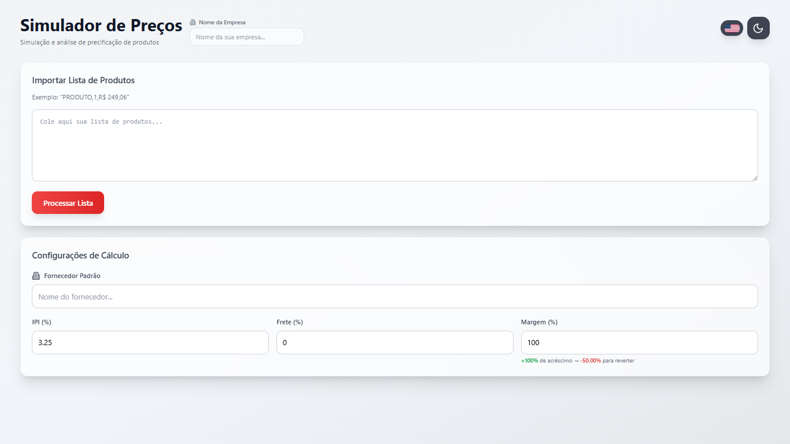
  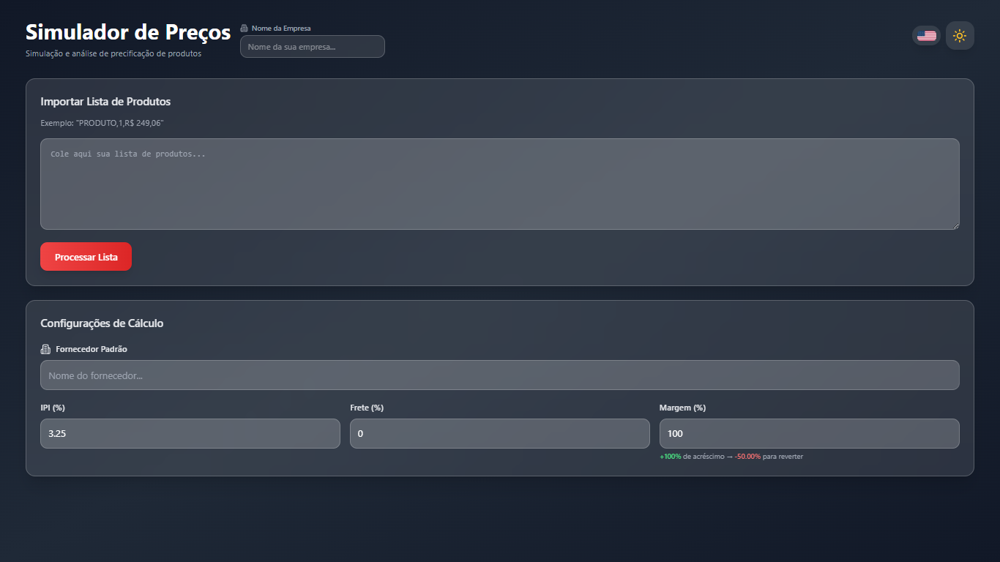
</p>

<p align="center">
  <b>Tabela de Produtos & Barra de Ações</b>
</p>
<p align="center">
  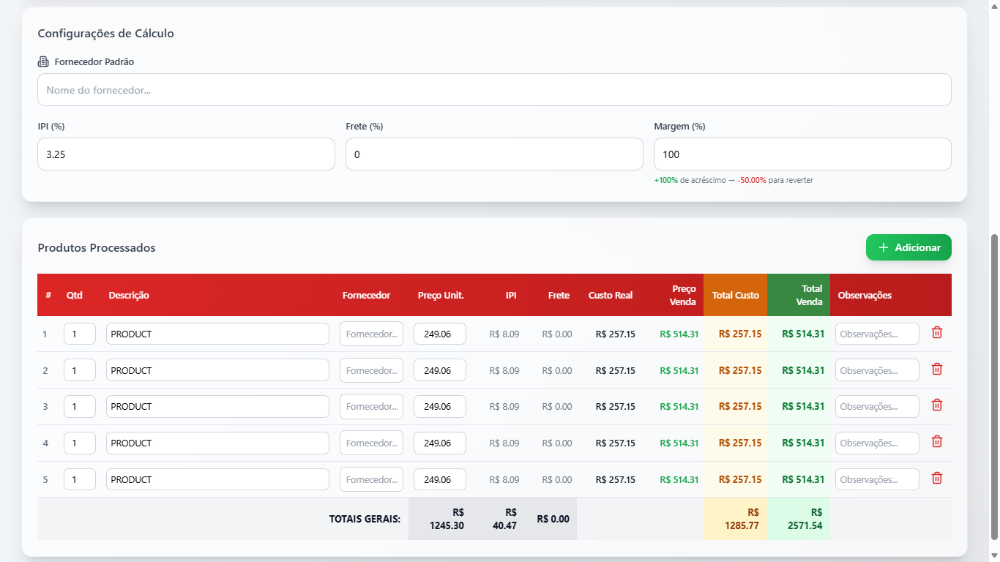
  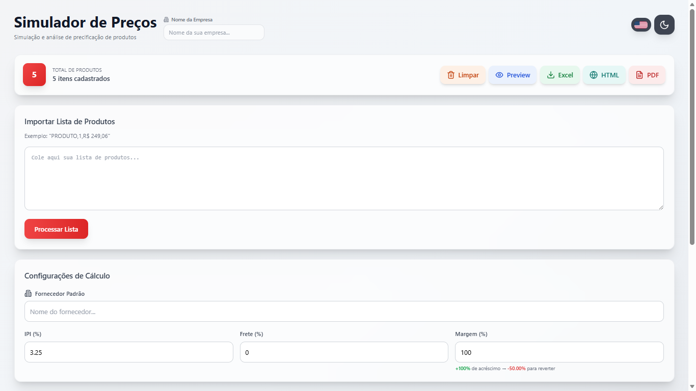
</p>

<p align="center">
  <b>Modal de Prévia & Seleção de Colunas</b>
</p>
<p align="center">
  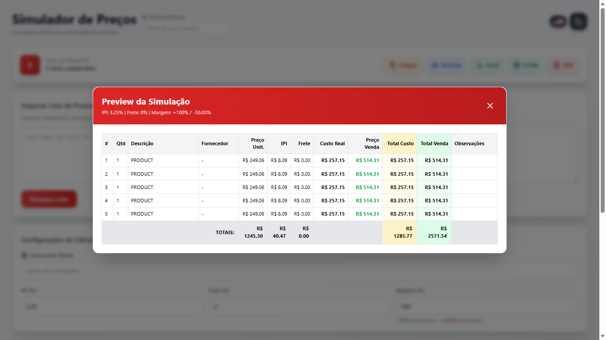
  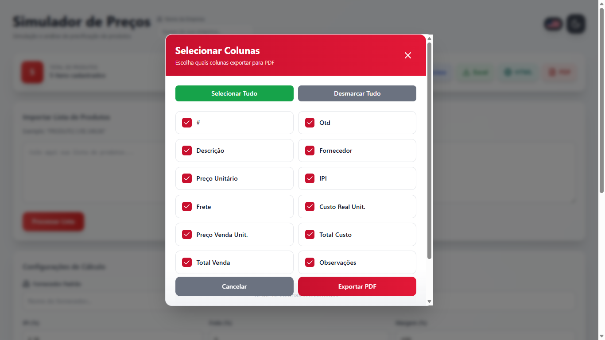
</p>

<p align="center">
  <b>PDF Gerado</b>
</p>
<p align="center">
  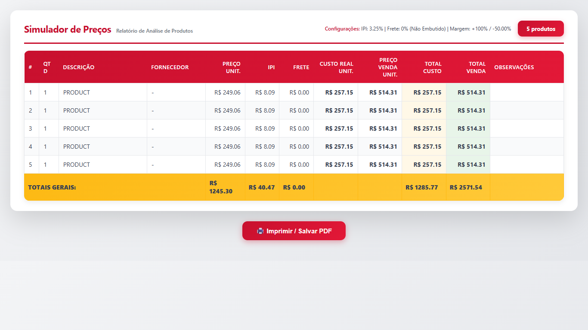
</p>

</details>

<details>
<summary>📱 Versão Mobile (Clique para expandir)</summary>
<br/>

<div align="center">

| ☀️ Modo Claro | 🌙 Modo Escuro |
| :---: | :---: |
| **Tela Inicial / Home** | **Tela Inicial / Home** |
| 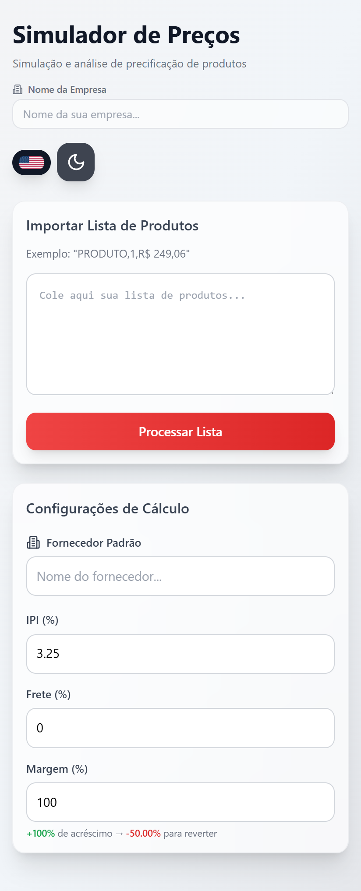 | 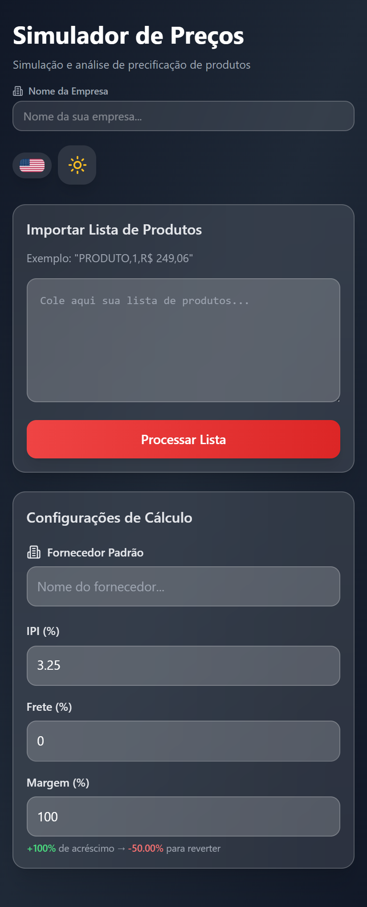 |
| **Tabela de Produtos** | **Tabela de Produtos** |
| 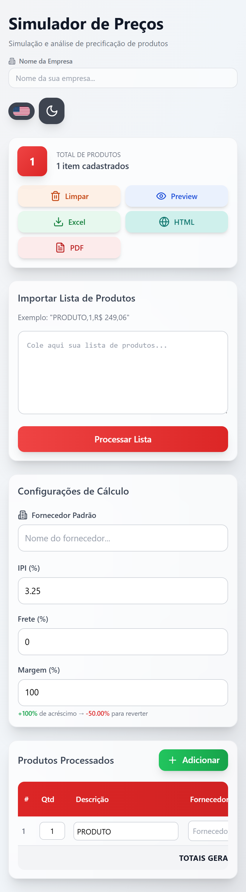 | 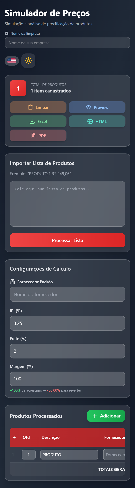 |
| **Seleção de Colunas** | **Seleção de Colunas** |
| 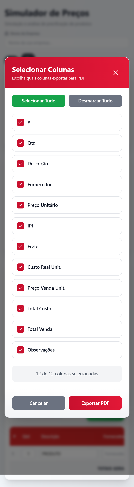 | 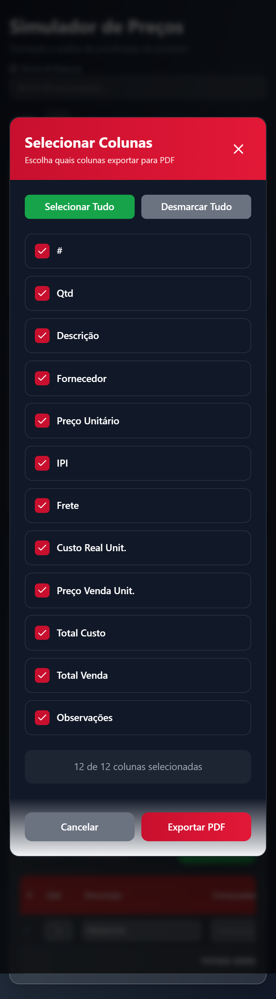 |

</div>

</details>

<br/>

> 📑 **Documentação completa:** Acesse a documentação técnica interativa em [docs/PriceSim-Documentation-v1.html](docs/PriceSim-Documentation-v1.html)

---

## ⚡ Tecnologias Utilizadas

O projeto foi construído utilizando as seguintes tecnologias e ecossistemas:

- **React 18** — Biblioteca para construção de interfaces SPA dinâmicas
- **Vite** — Build tool ultra-rápido para o ambiente de desenvolvimento front-end
- **Tailwind CSS** — Framework CSS utilitário para estilização responsiva e moderna
- **Lucide React** — Conjunto de ícones consistentes e otimizados em SVG
- **HTML5 / CSS3** — Estrutura e customizações básicas da página
- **JS Vanilla (Geradores)** — Lógica customizada nativa para conversão e geração de XLS, HTML e PDF (sem dependências externas pesadas)

---

## 🚀 Instalação e Execução

Para executar o projeto localmente na sua máquina, siga os passos abaixo:

### Passo 1: Clonar o repositório
```bash
git clone https://github.com/pedrolabre/price-simulator.git
cd price-simulator
```

### Passo 2: Instalar as dependências
```bash
npm install
```

### Passo 3: Iniciar o servidor de desenvolvimento
```bash
npm run dev
```

Acesse a aplicação através do endereço `http://localhost:5173`.

---

## 💡 Como Usar

### 📥 Importar produtos por texto livre
Cole sua lista de produtos no campo de importação seguindo um dos formatos aceitos e clique em **Processar**:

#### 1. CSV ou Cópia de Planilha (com ou sem cifrão)
```text
Produto A, 2, R$ 149,90
Produto B, 1, $ 249.06
```

#### 2. Lista de Compras Simples (padrão quantidade + nome + valor)
```text
3x Cabo USB R$ 29,90
Monitor R$ 1.299,00
```

#### 3. Valores separados por ponto e vírgula
```text
Teclado; 2; 89,90
```

### ⚙️ Configurar parâmetros de precificação
Você pode ajustar os valores padrões globais no cabeçalho:

| Parâmetro | Padrão | Descrição |
| :--- | :---: | :--- |
| **IPI** | `3,25%` | Imposto sobre Produto Industrializado aplicado ao valor base. |
| **Frete** | `0%` | Percentual de custo de frete adicionado ao produto. |
| **Margem** | `100%` | Markup/lucro desejado sobre o custo real total do item. |

### 📤 Exportar relatórios simulados
1. Na barra de ações superior, escolha o formato desejado: **XLS**, **HTML ou **PDF**.
2. Na janela pop-up, selecione quais colunas devem fazer parte do relatório final.
3. Visualize a prévia e clique em exportar/imprimir.

---

## 📁 Estrutura do Repositório

O projeto está organizado da seguinte forma:

```text
price-simulator/
├── assets/                     # Recursos visuais (ícones e screenshots)
├── docs/                       # Documentação estática e manuais
├── src/                        # Código-fonte da aplicação React
│   ├── components/             # Componentes da UI (Header, ProductTable, Modais...)
│   ├── hooks/                  # Hooks customizados (useProducts, useCalculations, useParser...)
│   ├── utils/                  # Geradores e formatadores (xlsGenerator, pdfGenerator, calculations...)
│   ├── constants/              # Padrões e dicionário de traduções (translations...)
│   ├── App.jsx                 # Componente raiz da aplicação
│   └── main.jsx                # Ponto de entrada do React
├── package.json                # Gerenciamento de dependências e scripts do Node
├── tailwind.config.js          # Configurações do Tailwind CSS
└── vite.config.js              # Configurações do compilador Vite
```

---

## 👨‍💻 Guia de Desenvolvimento

Se precisar expandir ou customizar o simulador, siga estas referências rápidas:

### 🧩 Adicionar novo formato de importação por regex
1. Abra o arquivo [parsers.js](./src/utils/parsers.js).
2. Insira um novo bloco de validação `if (!matched)` contendo a lógica de Regex adequada para capturar `quantity`, `name` e `price`.
3. Adicione testes colando a nova string no painel de importação.

### 📊 Adicionar nova coluna nos relatórios de exportação
1. Modifique a lógica matemática no arquivo [calculations.js](./src/utils/calculations.js).
2. Adicione a nova chave na listagem de colunas do componente `ExportModal`.
3. Mapeie a coluna respectiva dentro dos geradores específicos em:
   - [xlsGenerator.js](./src/utils/xlsGenerator.js)
   - [htmlGenerator.js](./src/utils/htmlGenerator.js)
   - [pdfGenerator.js](./src/utils/pdfGenerator.js)

### 🌐 Adicionar suporte a outro idioma
1. Registre as novas traduções em [translations.js](./src/constants/translations.js).
2. Adicione o botão alternador (toggle) correspondente dentro do arquivo `Header.jsx`.

---

## 📝 Convenções de Código

Para manter o repositório limpo e organizado, seguimos as diretrizes abaixo:

- **React 18**: Desenvolvimento inteiramente baseado em hooks funcionais e componentes reutilizáveis.
- **Tailwind CSS**: Estilização direta por classes utilitárias, evitando a criação de arquivos CSS globais/locais adicionais.
- **Nomenclatura padrão**:
  - Arquivos comuns e pastas auxiliares em `camelCase` (ex: `xlsGenerator.js`).
  - Componentes React em `PascalCase` (ex: `ExportModal.jsx`).
- **Exportações**: Preferência por exportações nomeadas para funções utilitárias e hooks customizados.

---

## 📄 Licença

Este projeto está licenciado sob os termos da licença **MIT**. Veja o arquivo [LICENSE](./LICENSE) para mais detalhes.

---

<div align="center">
Desenvolvido com 💙 por <b>Pedro Labre</b>
</div>
